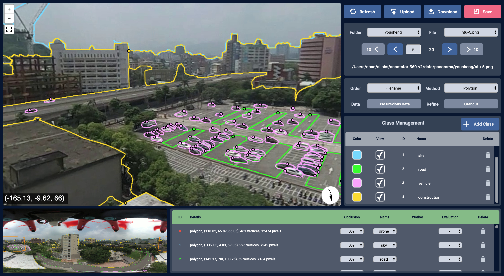

# Label360

An annotation interface for labelling instance-aware semantic labels on panoramic full images, which outperforms other annotation tools in terms of efficiency and quality. Here is our demo site (https://label-360.droneye.tw).
[](https://label-360.droneye.tw)

## Dataset
We also provides high quality dense annotations. If you find the dataset is useful, please [cite](#citation) us.

### Polygon Annotations
[Download Dataset](https://drive.google.com/file/d/1drnS-r-txi3n1sBJFfDwTpn9_HWfg1Gg)

* Total # of images: 370
* Scenes
    * NTU: 3
    * Tainan street view: 286
    * Tai-61 express way: 81
* Total # of annotations: 72763
    * Building: 33316
    * Buildings: 7040
    * BuildingIgnore: 1335
    * Bicycle: 18
    * Bicycles: 15
    * Car: 23847
    * Cars: 1201
    * CarIgnore: 113
    * FreightCar: 171
    * Motorcycle: 3940
    * Motorcycles: 96
    * Trailer: 63
    * Truck: 1363
    * Van: 80
    * Vertices: 363815

### Bounding Box Annotations
[Download Dataset](https://drive.google.com/file/d/1RIHenS6PQoUXtshh5iBur0MtpInLHA8u)
* Total # of images: 26
* Scene: NTU
* Total # of annotations: 5763
    * Bicycle: 288
    * Bicycles: 131
    * Building: 2733
    * Buildings: 208
    * BuildingIgnore: 141
    * Car: 1515
    * Cars: 35
    * CarIgnore: 3
    * FreightCar: 15
    * Motorcycle: 629
    * Motorcycles: 23
    * Truck: 38
    * Van: 4

### [Experiment Result](https://drive.google.com/file/d/1i8Fqle_D_Q7_UKWQ3dTLDrRS2RgvNGwa)
* Total # of images: 20
* Scenes: 
    * NTU :5)
    * Tainan street view (5)
    * Tai-61 express way (10)
* Categories
    * Drone
    * Sky
    * Road
    * Vehicle
    * Construction
    * Nature
    * Human

# Citation
```
@incollection{lin2020label360,
  title={Label360: An Annotation Interface for Labeling Instance-Aware Semantic Labels on Panoramic Full Images},
  author={Lin, Liang-Han and Wen, Hao-Kai and Kao, Man-Hsin and Chen, Evelyn and Lin, Tse-Han and Ouhyoung, Ming},
  booktitle={SIGGRAPH Asia 2020 Posters},
  pages={1--2},
  year={2020}
}
```

## Acknowledgements
This project was funded by Ministry of Science and Technology (MOST).
